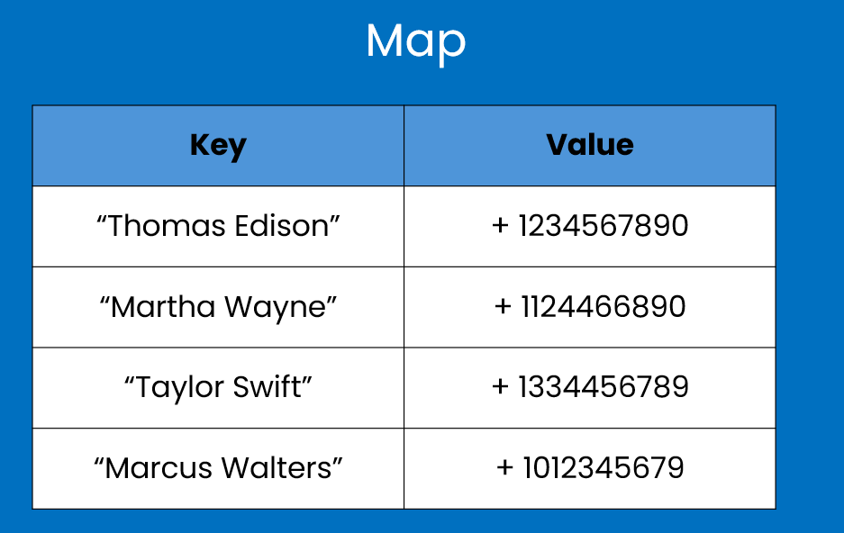

## Map
Map is a data structure that stores elements as key-value pairs, where each key is unique
and is used to access its associated value.

    

 
In java, there is a Map interface with its 
implementation classes. Map noes not belong to Collection interface hierarchy, 
it does not extend it, but still is considered as a part of Java
collections framework, as its elements can be manipulated, added, removed, modified, 
iterated like any other collection. Reason, why it does not extend Collection interface
is that Map has key-value pairs, which are not common for other data structures in the
hierarchy.

Map data structure in Java is presented by two interfaces: Map and SortedMap. Popular 
implementations of these interfaces are: HashMap, TreeMap, and LinkedHashMap.

## Use Cases
Maps are recommended to use when there are entries with key-value pairs. Every key is
mapped to exactly one value, and the key is used to retrieve corresponding value 
from the map. An example of this can be a phone book, when you know someone's full name,
and you want to look up his phone number.

## HashMap
HashMap provides the implementation of Map interface. It provides all the optional
map operations, permits null values and a single null key. For basic operations such as
getting an item by key and putting an item in a map, on average it takes constant time - O(1).

## HashMap Internals

Inside the HashMap, there is an array of buckets. Each bucket is a LinkedList is of type Node,
which itself stores the key-value pairs of map elements.

The Node class has the following fields:
* hash: represents the hash code of the key
* key: represents the key of the entry
* value: represents the value of the entry
* next: reference to the next node in the linked list

When you insert the entry inside HashMap, using the put() method, first HashMap
calculates the hash code of the key. The hash function is generally implemented in
a way, that reduced the chance of collisions to a minimum. After generating the hash
code, the next step is calculating the index to determine index of the array of buckets
where this new entry will be stored. If there are cases when more than one keys end up
having the same index values, it causes collision. Collision is handles using on of the
ways:
* Linking - When the key exists in a LinkedList and the entry gets appended as a new node
inside this list.
* Treeification - When number of nodes inside bucket (which is a linkedlist) exceeds the
certain treshold (this is called TREEIFY_THRESHOLD), then this linked list will turn into
a tree. This feature was introduced in Java 8.

Retrieval and deletion operations work in a similar way. 
Retrieval happens using get() method. First hash code gets calculated, using the hash code
the index value gets discovered, then inside the bucket either a linked list or tree
is being traversed to find the node with matching key.

In case of deletion the same process goes on: calculating the hash code, calculating the
index, removing the node from the bucket.

## Time Complexity
Main HashMap operations such as get(), put(), remove(), in general take O(1), assuming the
keys are uniformly distributed. In case of collisions, these operations will degrade
to O(log n) when the treeification happens. Mathematical explanation of O (log n) time
for balanced binary tree was explained in [Sets](../sets/sets.md), when we analysed time complexity of
TreeSet.

## Other implementations
Among other Map implementations are TreeMap, LinkedHashMap, and
ConcurrentHashMap, and legacy implementation of Hashtable.

LinkedHashMap preserves the insertion order of entries. And you should
use it if the insertion order matters. 

TreeMap is used when you need sorted order. Keys are sorted
in natural order or by a custom comparator. 

Hashtable is a legacy implementation, which is thread-safe. 
It is an old implementation, and does not allow null keys or values.

ConcurrentHashMap is modern and highly optimized alternative
of Hashtable. It is used when you need concurrent access.

There is **WeakHashMap** implementation, which is used store object references in such a way 
that they can be garbage collected when no strong references to the keys exist,
and **IdentityHashMap** which is for handling object identity, as it is
storing the keys by comparing with '==' instead of equals() method.

https://www.geeksforgeeks.org/map-interface-java-examples/ 

