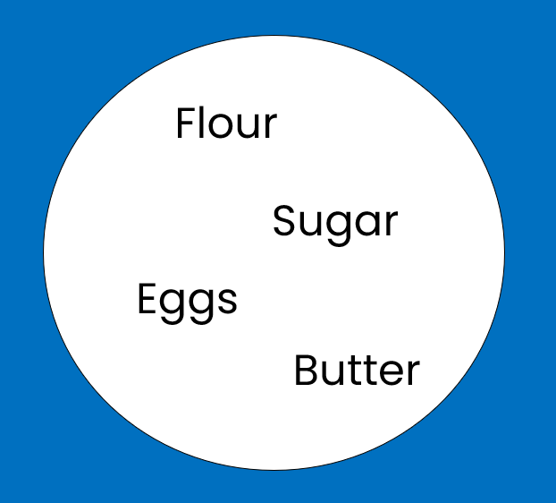
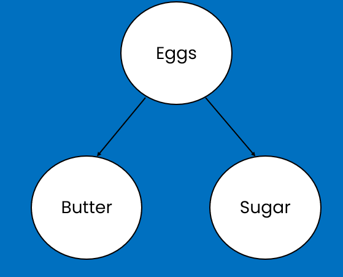
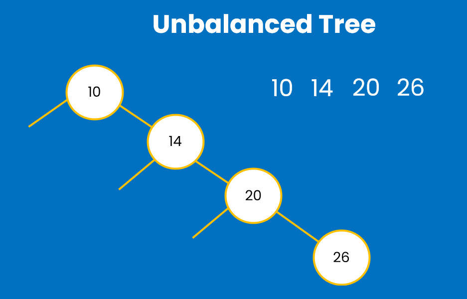
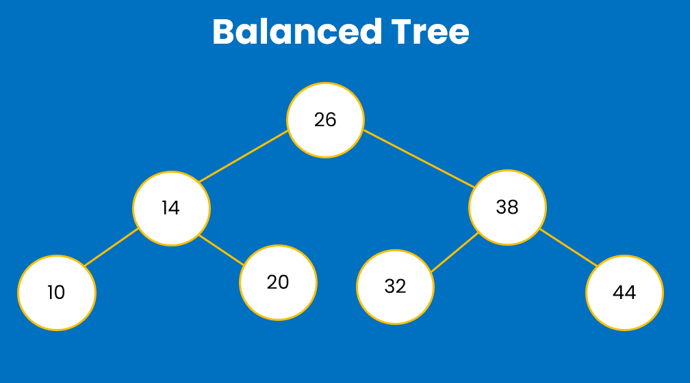

You need to use Set data structure when you do not
want to allow duplicate entries. For example, you need
to buy different ingredients to bake some cookies.
You need to track the ingredients you have purchased, and
you need to avoid buying duplicate items, but also ensure you
get all required ingredients. As you purchase an ingredient, 
you remove it from the set. If someone suggests buying the
ingredient you've already purchased, you do not
add it again, because sets do not allow duplicates.

<br/>
Popular Set implementations are: HashSet and TreeSet.
HashSet internally uses a HashMap to store its elements. Each element in 
the HashSet is stored as a key in the underlying HashMap, and a dummy value as a constant
value (commonly the value "PRESENT") is used to represent the presence of the key.
The HashSet relies on the hashCode() method of its elements to calculate the hash, 
which determines the bucket in the HashMap where the element is stored.
Because of this design, in terms of time complexity, main advantage of HashSet is
that adding an element or checking if the element exists
inside the set both have on average constant time O(1). However, in cases of
hash collisions, there may be additional lookups within the bucket,
which can degrade performance to O(n) or O (log n) if using Java 8the version 
and onwards. But the hashCode() method is implemented in such a way to avoid collisions
as much as possible.

Another popular Set implementation is TreeSet. It stores 
its elements in a sorted tree structure. Its main benefit
is that the set is always in a sorted order. Downside
is that adding and checking if the element already exists
takes longer than for the HashSet, especially when the tree
becomes bigger. We can represent TreeSet like in the picture
below:


Here, we can see that the names of the ingredients are sorted
by natural ordering of their first letters, meaning that
'B' is before 'E' and 'S' is after it, so it is located
on the right side of 'Eggs' element.
TreeSet is using red-black tree, which is a balanced
binary search tree. Let's visualize what this means. 
Let's suppose we have the following element values:
10, 14, 20, 26, 32, 38, 44, 50, 62. In binary tree,
we have the root element, in this case, let's assume that
10 is the root element. Anything bigger than 10 will be
added as a node on the right of 10, so 14 will be on the right node.
then as the next child node, there will be 20, 26 and so on.
As we can see on the picture, this will be unbalanced tree,
meaning that we have all the child nodes, but only on one 
side of the parent nodes.

When the tree is balanced, then it looks like this:


Let's assume, we are searching for the number 44. We start at the
root element which is 26. 44 is more than 26, which means
we continue lookup only on the right side of the tree. This
halves down the number of n nodes, through which we need to
perform lookup, next we compare 38 with 44, and since 44 is more 
than 38, we continue right, at this stage, we still ignore
left side, because there will be only elements less than 38,
then we find our target element - 44. As you can see,
at each level of the binary tree, we halve down the number
of elements to be searched. To analyse this mathematically,
number of nodes at the beginning for level 0 (root) is only
1 node, then at level 1 there are 2 nodes, at level 2 - 4 nodes,
and to generalize this with the formula - at level
_h_ there will be 2<sup>h</sup> nodes.
Total number of nodes in the tree is sum of nodes at
each level, so it will be:
<div style="text-align: center;">N = 1 + 2 + 4 + ... + 2<sup>h</sup> = &#8721;<sub>i=0</sub><sup>h</sup> 2<sup>i</sup>
<br/> 
    <div style="text-align: center;">Where n = 2<sup>h + 1</sup> - 1 
<br/>
2<sup>h + 1</sup> = n + 1 => log<sub>2</sub>(n+1) <br/>
=> <br/>
h = log<sub>2</sub>(n+1) - 1
</div>
</div>

Thus, the height - _h_ grows logarithmically with n. 
This analysis is the reason, why
we come to the conclusion that the time complexity of adding an element and finding the item
in a TreeSet is O(log n). Because we have to go and navigate through
the balanced binary tree as shown above.

If you create a HashSet of some objects, let's say
Integers and you try to add the same element twice, it
will only save the element once, without duplication.
<br/>
```
setOfIntegers.add(7);
setOfIntegers.add(7);
```


If you need a Set implementation that maintains the insertion and retrieval order of elements,
you can use **LinkedHashSet**. It ensures that elements are iterated in the order they were 
added, thanks to its internal use of a HashMap with a doubly linked list to track insertion
order. Unlike TreeSet, however, LinkedHashSet does not sort its elements—it only preserves
their insertion order.

| Feature        | HashSet                      | TreeSet                                   | LinkedHashSet                     |
|----------------|------------------------------|-------------------------------------------|-----------------------------------|
| Ordering       | Unordered                    | Sorted (Natural order <br/>or comparator) | Insertion order                   |
| Null Elements  | Allows one **null** element  | Does not allow **null** elements          | Allows one **null** element       |
| Use Case       | When ordering doesn't matter | When sorted order is required             | When insertion order matters      | 
| Implementation | HashMap                      | Backed by red-black tree (TreeMap)        | HashMap with a doubly-linked list |

