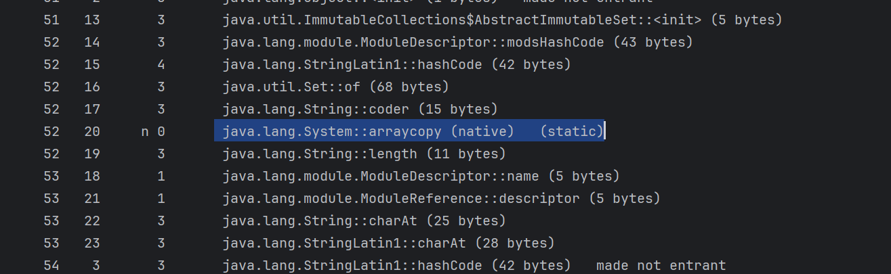
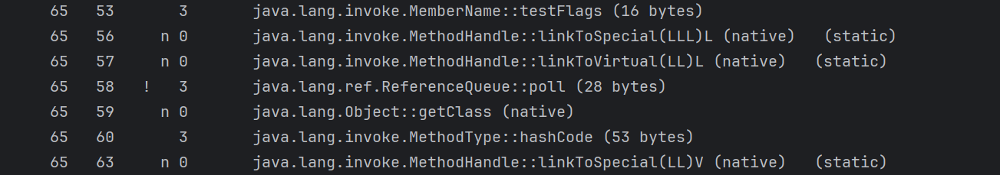

## VM Options
Java Virtual Machine (JVM) options are parameters that can be 
passed to the JVM at startup. They control various aspects of the JVM's behavior,
such as memory management, garbage collection, and performance tuning.

We can pass flag:
-XX:+PrintCompilation

to the VM options to see the compilation log. This will
show us what was compiled by the JIT compiler and when they were compiled.
On this example picture below:


n indicates the native method.

The ! symbol means the exception handling.

-XX:+UnlockDiagnosticVMOptions
-XX:+LogCompilation

This command will print code cache details: <br/>
``` -XX:+PrintCodeCache ```


## Pass By Value
In java, all arguments are passed by value. This means that when you pass a variable to a method,
the method receives a copy of the variable's value, not the variable itself. This applies to
both primitive types and reference types.
For primitive types, the value is copied directly. For reference types, the reference (or pointer)
to the object is copied, not the actual object. This means that if you modify the object
through the reference, the changes will be reflected in the original object, but if you
reassign the reference to a new object, it will not affect the original reference value.
